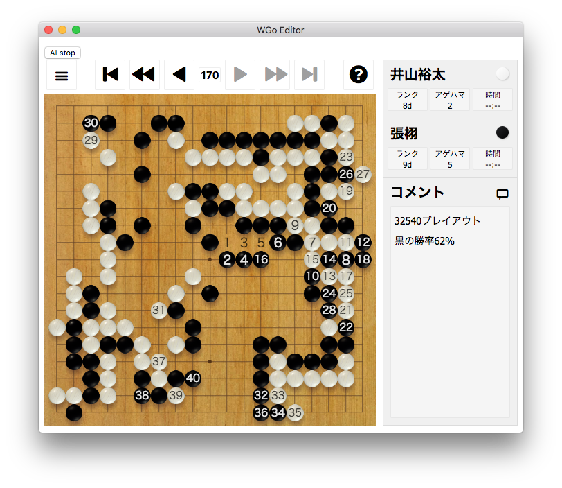

# WGo Editor
[WGo.js](http://wgo.waltheri.net/)を使ったSGFエディタです。
[Leela](https://www.sjeng.org/leela.html)や[Leela Zero](https://github.com/gcp/leela-zero)と連携して局面検討ができるのが特長です。

(LeelaもしくはLeela Zeroは別途インストールしてください)

## LeelaもしくはLeela Zeroの設定
画面下の"AI start”ボタンを始めてクリックすると、設定ウィンドウが現れます。
LeelaもしくはLeela Zeroの欄を埋めてください。
設定が終わってから再度"AI start”ボタンをクリックすると、Leelaが検討を始めてリアルタイムで読み筋を表示します。

## ダウンロード

- [64bit Windows用](https://github.com/y-ich/wgo-editor/releases/download/v0.1.0/wgo-editor.win-x64.zip) (パッケージ作っただけで動作未確認です、すみません…)
- [macOS用](https://github.com/y-ich/wgo-editor/releases/download/v0.1.0/wgo-editor.mac-x64.zip)
- [64bit Linux用](https://github.com/y-ich/wgo-editor/releases/download/v0.1.0/wgo-editor.linux-x64.zip) (パッケージ作っただけで動作未確認です、すみません…)
